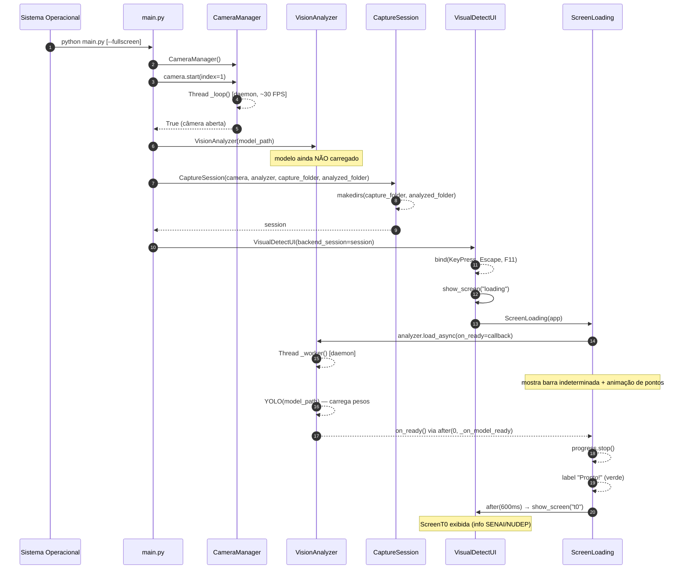
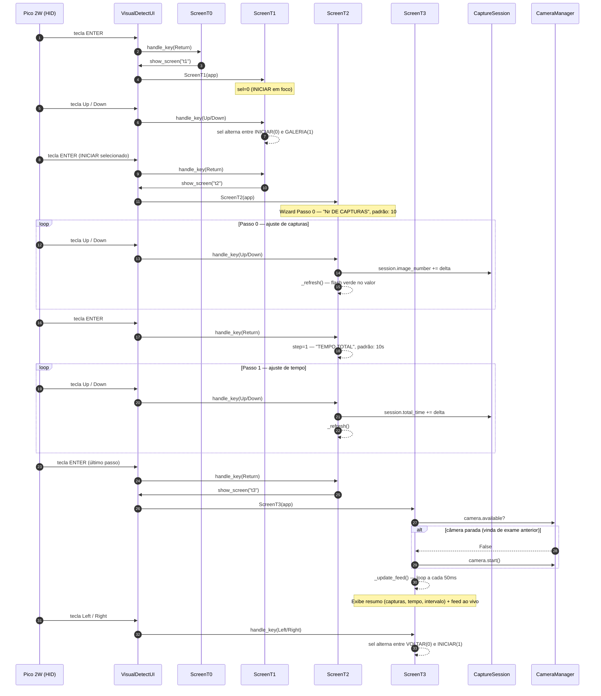
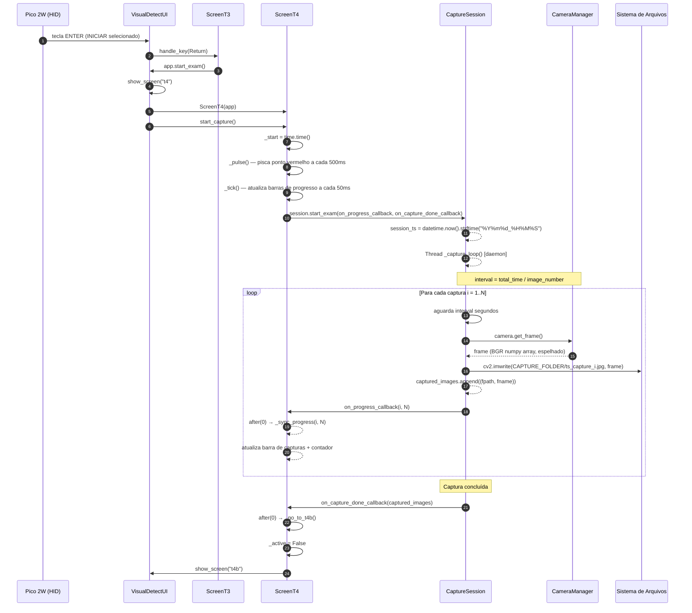
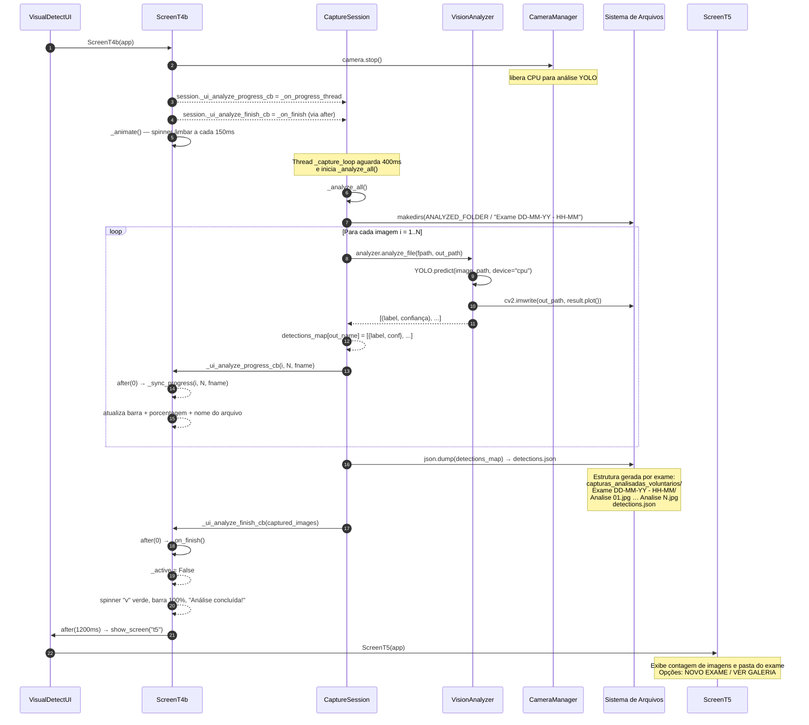
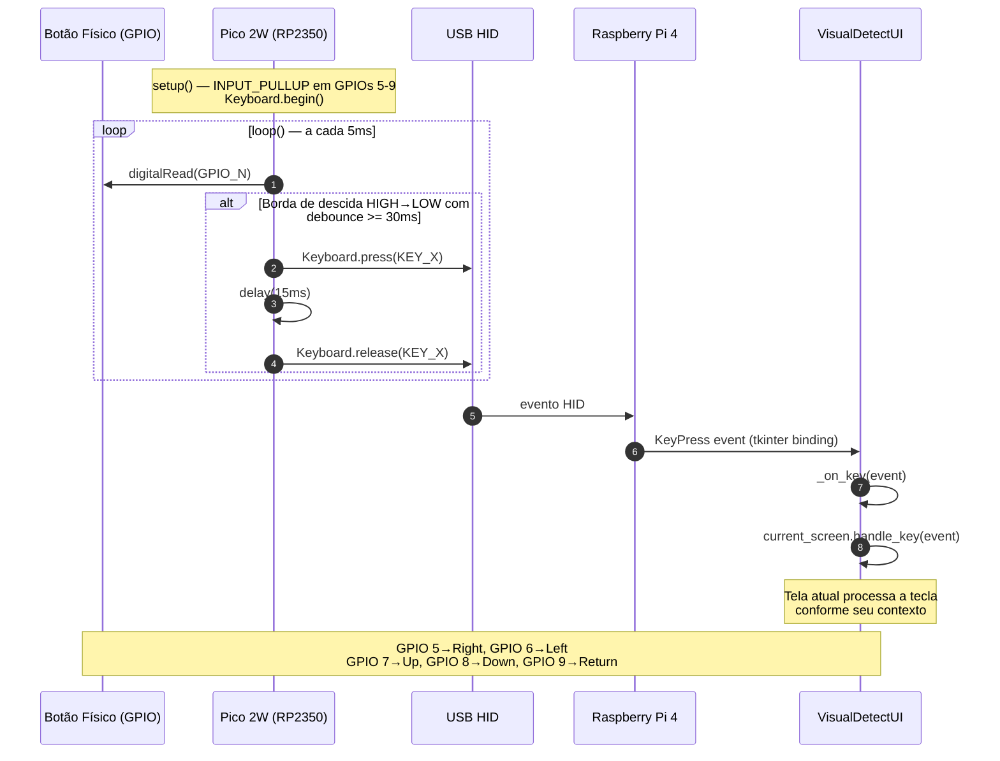

# Diagramas de Sequência — VisualDetect

> **Projeto:** VisualDetect — Equipamento de Triagem do Reflexo Ocular
> **Versão:** 1.0 · Setembro 2026
> **Autores:** Yuri Mendes | Andrei Krug

Os diagramas estão divididos em **5 partes** cobrindo todos os fluxos do sistema:

| Parte | Fluxo |
|-------|-------|
| [1](#parte-1--inicialização-do-sistema) | Inicialização do sistema (`main.py` → Loading → T0) |
| [2](#parte-2--navegação-e-configuração-do-exame) | Navegação e configuração do exame (T1 → T2 → T3) |
| [3](#parte-3--captura-de-imagens) | Captura de imagens (T3 → T4) |
| [4](#parte-4--análise-yolo-e-persistência) | Análise YOLO e persistência (T4b) |
| [5](#parte-5--galeria-e-controle-hid) | Galeria e controle físico HID (Pico 2W) |

---

## Parte 1 — Inicialização do Sistema

> Cobre o startup do processo: instanciação dos objetos de backend, carregamento assíncrono do modelo YOLO e exibição da tela de loading.



---

## Parte 2 — Navegação e Configuração do Exame

> Cobre a jornada do usuário desde a tela inicial (T0) até a tela de revisão com feed de câmera (T3), passando pelo wizard de configuração (T2).



---

## Parte 3 — Captura de Imagens

> Cobre o fluxo de captura automática periódica (T3 → T4), incluindo as threads paralelas de captura e de atualização da UI.



---

## Parte 4 — Análise YOLO e Persistência

> Cobre o processamento pós-captura: análise com YOLO em background (T4b), persistência dos resultados e navegação para a tela de conclusão (T5).



---

## Parte 5 — Galeria e Controle Físico HID

### 5a — Navegação na Galeria

```mermaid
sequenceDiagram
    autonumber
    participant HID as Pico 2W (HID)
    participant UI  as VisualDetectUI
    participant T5  as ScreenT5
    participant GAL as ScreenGaleria
    participant CS  as CaptureSession
    participant FS  as Sistema de Arquivos

    HID->>UI: tecla Right (VER GALERIA selecionado)
    UI->>T5: handle_key(Right)
    T5-->>T5: sel=1 — destaca VER GALERIA

    HID->>UI: tecla ENTER
    UI->>T5: handle_key(Return)
    T5->>UI: app._gallery_origin = "t5"; show_screen("galeria")
    UI->>GAL: ScreenGaleria(app)

    GAL->>CS: session.get_exam_gallery()
    CS->>FS: listdir(ANALYZED_FOLDER) — ordena desc
    FS-->>CS: pastas "Exame ..."
    CS->>FS: open(detections.json) por pasta
    FS-->>CS: detections dict
    CS-->>GAL: [{name, folder, images, detections}, ...]
    Note over GAL: Nível 1 — lista de exames

    loop Nível 1 — seleciona exame
        HID->>UI: tecla Up / Down
        UI->>GAL: handle_key(Up/Down)
        GAL-->>GAL: exam_idx ±1 — destaque na lista
    end

    HID->>UI: tecla ENTER
    UI->>GAL: handle_key(Return)
    GAL-->>GAL: level=2 → _show_level2()
    Note over GAL: Nível 2 — lista "Analise NN.jpg"

    loop Nível 2 — seleciona imagem
        HID->>UI: tecla Up / Down
        UI->>GAL: handle_key(Up/Down)
        GAL-->>GAL: image_idx ±1
    end

    HID->>UI: tecla ENTER
    UI->>GAL: handle_key(Return)
    GAL-->>GAL: level=3 → _show_level3()
    Note over GAL: Nível 3 — imagem anotada + detecções + confiança %

    HID->>UI: tecla Left
    UI->>GAL: handle_key(Left)
    GAL-->>GAL: level=2 → _show_level2()

    HID->>UI: tecla Left
    UI->>GAL: handle_key(Left)
    GAL-->>GAL: level=1 → _show_level1()

    HID->>UI: tecla Left (sair da galeria)
    UI->>GAL: handle_key(Left)
    GAL->>UI: show_screen(gallery_origin)
    Note over UI: Volta para T1 (acesso direto) ou T5 (pós-exame)
```

### 5b — Ciclo de Controle HID (Pico 2W)



---

## Resumo dos Participantes

| Participante | Arquivo / Hardware | Responsabilidade |
|---|---|---|
| `main.py` | `app/main.py` | Ponto de entrada — instancia e conecta todas as camadas |
| `CameraManager` | `app/backend.py` | Thread de captura contínua (~30 FPS) |
| `VisionAnalyzer` | `app/backend.py` | Carregamento e inferência YOLO |
| `CaptureSession` | `app/backend.py` | Coordena fluxo completo de um exame |
| `VisualDetectUI` | `app/ui.py` | Janela principal, roteamento de telas e teclado |
| `ScreenLoading` | `app/ui.py` | Tela de loading do modelo YOLO |
| `ScreenT0–T5` | `app/ui.py` | Telas individuais da aplicação |
| `ScreenGaleria` | `app/ui.py` | Biblioteca de exames analisados (3 níveis) |
| `Pico 2W (RP2350)` | `firmware/.../pico2w_hid_controller.ino` | Controle físico via USB HID |
| `Sistema de Arquivos` | Disco local | Persistência de imagens e `detections.json` |
