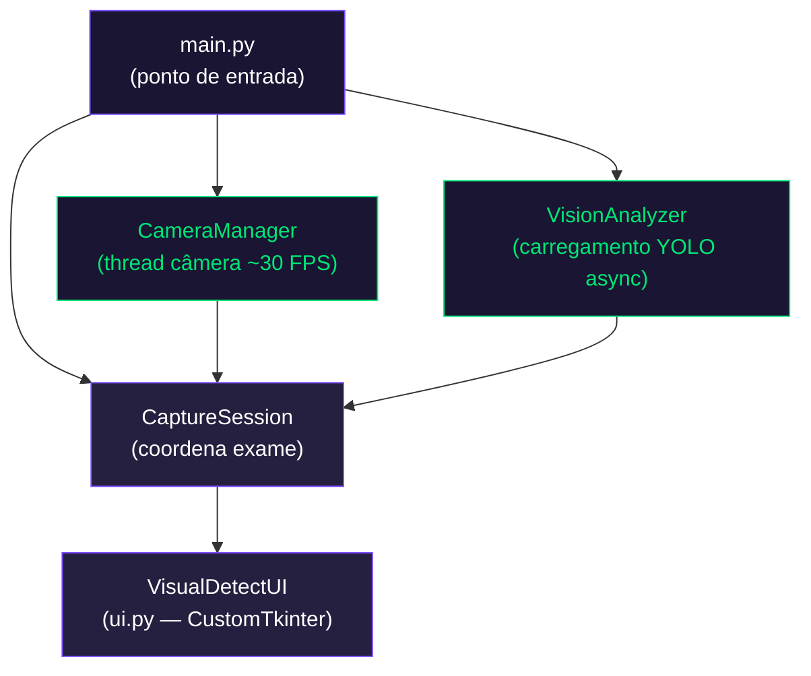
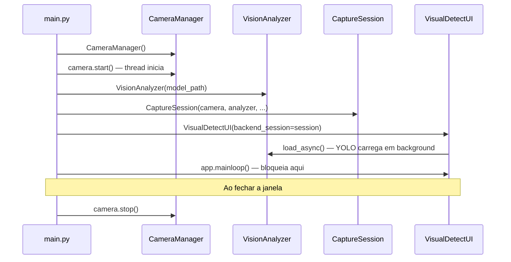
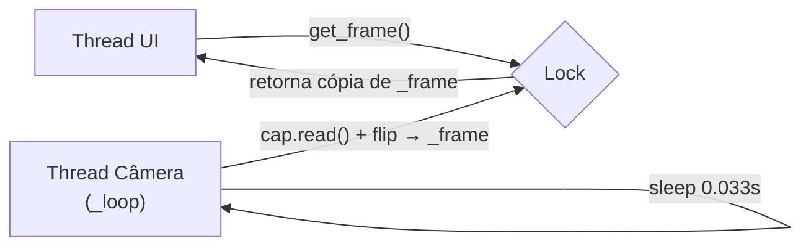
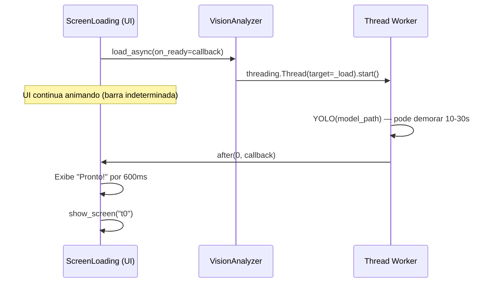
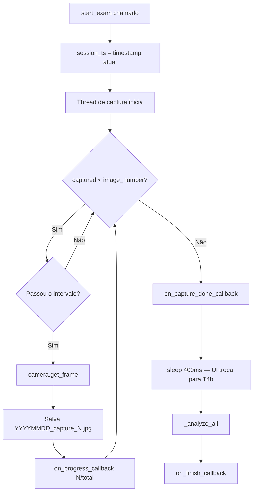
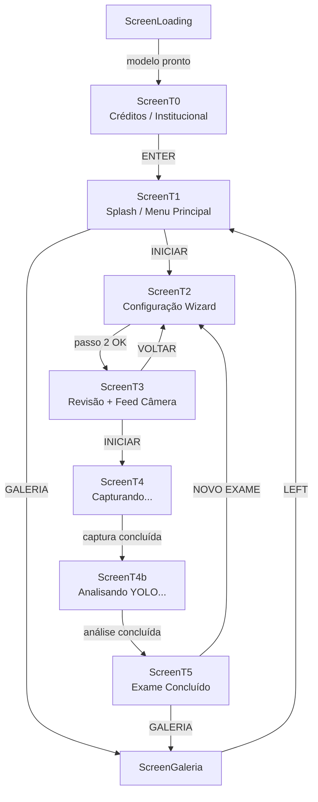
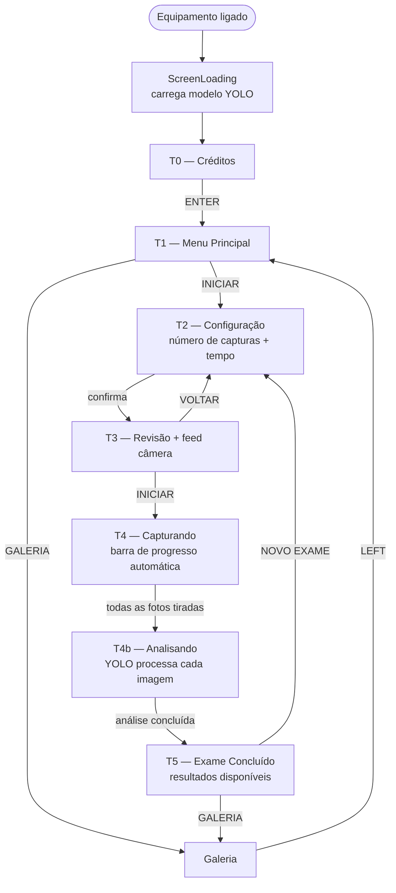
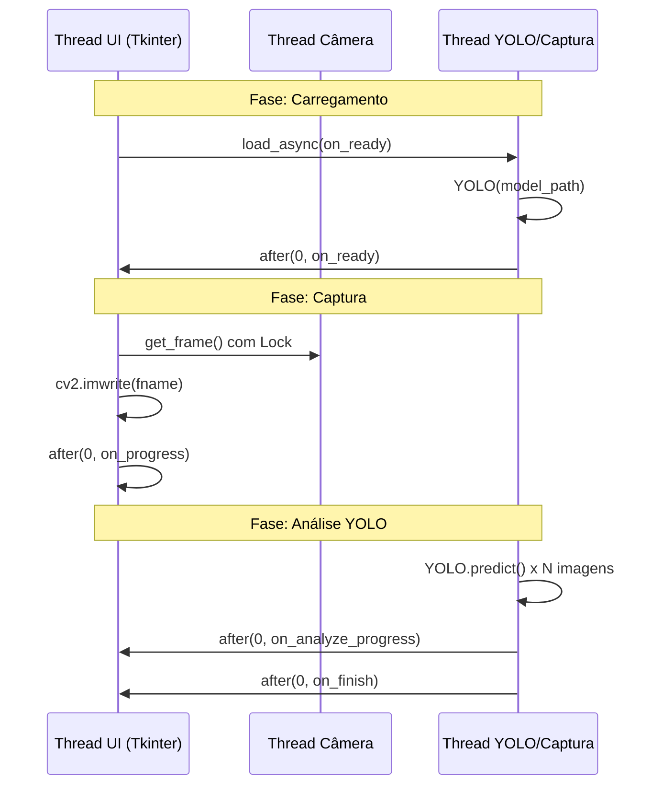
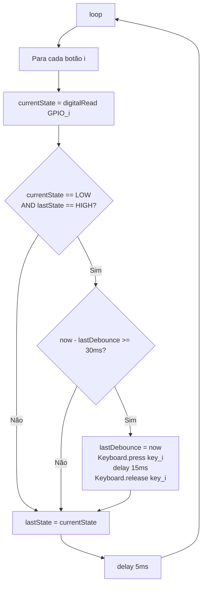
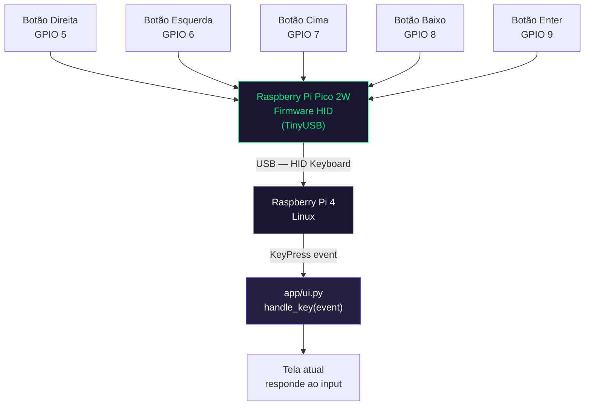

# Manual Técnico — VisualDetect

> **Projeto:** VisualDetect — Equipamento de Triagem do Reflexo Ocular
> **Versão:** 1.0 · Setembro 2026
> **Autores:** Yuri Mendes | Andrei Krug
> **Instituição:** SENAI / NUDEP

---

## Índice

1. [Visão Geral do Sistema](#1-visão-geral-do-sistema)
2. [Arquitetura Geral](#2-arquitetura-geral)
3. [Estrutura de Arquivos](#3-estrutura-de-arquivos)
4. [Módulo `main.py`](#4-módulo-mainpy--ponto-de-entrada)
5. [Módulo `backend.py`](#5-módulo-backendpy--camada-de-lógica)
6. [Módulo `ui.py`](#6-módulo-uipy--interface-gráfica)
7. [Fluxo Completo de um Exame](#7-fluxo-completo-de-um-exame)
8. [Comunicação entre Threads](#8-comunicação-entre-threads)
9. [Sistema de Arquivos Gerados](#9-sistema-de-arquivos-gerados)
10. [Firmware — pico2w_hid_controller](#10-firmware--pico2w_hid_controller)
11. [Integração Hardware-Software](#11-integração-hardware-software)
12. [Dependências e Requisitos](#12-dependências-e-requisitos)
13. [Configurações e Parâmetros Ajustáveis](#13-configurações-e-parâmetros-ajustáveis)
14. [Navegação por Teclado / HID](#14-navegação-por-teclado--hid)

---

## 1. Visão Geral do Sistema

O **VisualDetect** é um sistema embarcado de triagem do reflexo ocular desenvolvido para auxiliar na detecção precoce do Retinoblastoma. O sistema combina:

- **Software Python** rodando em Raspberry Pi 4 (ou PC para desenvolvimento)
- **Firmware Arduino** no Raspberry Pi Pico 2W, que emula um teclado HID USB para controle físico via botões
- **Modelo YOLO** treinado para detecção de anomalias oculares via visão computacional

### Stack tecnológico

| Camada | Tecnologia | Versão mínima |
|--------|------------|---------------|
| Linguagem | Python | 3.11 |
| Interface gráfica | CustomTkinter (`ctk`) | 5.x |
| Visão computacional | Ultralytics YOLO | 8.x |
| Captura de imagem | OpenCV (`cv2`) | 4.x |
| Exibição de imagens | Pillow (PIL) | 9.x |
| Firmware controller | Arduino + arduino-pico | RP2350 |

---

## 2. Arquitetura Geral

O sistema segue uma arquitetura em três camadas com **injeção de dependência** — a UI nunca instancia backends diretamente.



**Princípios de design:**

| Princípio | Implementação |
|-----------|---------------|
| Separação de responsabilidades | `backend.py` não importa nada de `ui.py` e vice-versa |
| Injeção de dependência | `CaptureSession` é criada em `main.py` e entregue à UI |
| Thread safety | Toda atualização de widget vinda de thread usa `after(0, callback)` |
| Graceful degradation | `cv2` e `ultralytics` são opcionais — o app inicializa mesmo sem eles |

---

## 3. Estrutura de Arquivos

```
app/
├── main.py                              # Ponto de entrada — configura e conecta as camadas
├── backend.py                           # Lógica: câmera, YOLO, sessão de exame
├── ui.py                                # Interface gráfica (todas as telas)
│
├── assets/                              # Recursos visuais (logos PNG)
│   ├── logo - VisualDetect_greenPupil_png-Photoroom.png
│   ├── logo - VisualDetect.png
│   ├── logo - NUDEP_branco_png.png
│   └── logo - NUDEP_png.png
│
├── models/
│   └── best.pt                          # Modelo YOLO treinado (não incluso no repo)
│
├── capturas_voluntarios_analisar/       # Imagens brutas capturadas durante exames
│   └── YYYYMMDD_HHMMSS_capture_N.jpg
│
└── capturas_analisadas_voluntarios/     # Imagens com anotações YOLO por exame
    └── Exame DD-MM-YY - HH-MM/
        ├── Analise 01.jpg
        ├── Analise 02.jpg
        └── detections.json

firmware/
├── README.md
└── pico2w_hid_controller/
    ├── pico2w_hid_controller.ino        # Firmware ativo (Pico 2W → HID USB)
    └── README.md
```

---

## 4. Módulo `main.py` — Ponto de Entrada

**Linhas:** 95 | **Responsabilidade:** configuração, composição, inicialização.

### Parâmetros configuráveis

```python
MODELO_PATH     = os.path.join(_APP_DIR, "models", "best.pt")
CAPTURE_FOLDER  = os.path.join(_APP_DIR, "capturas_voluntarios_analisar")
ANALYZED_FOLDER = os.path.join(_APP_DIR, "capturas_analisadas_voluntarios")
```

> Para alterar qualquer caminho, edite apenas as três constantes acima.

### Sequência de inicialização



### Como executar

```bash
python main.py              # janela 800×480 (desenvolvimento)
python main.py --fullscreen # tela cheia (Raspberry Pi em produção)
python main.py -f           # equivalente ao acima
```

---

## 5. Módulo `backend.py` — Camada de Lógica

**Linhas:** 419 | Dependências externas com **graceful degradation**:

```python
CV2_AVAILABLE  = True   # False se opencv não instalado → câmera desabilitada
YOLO_AVAILABLE = True   # False se ultralytics não instalado → análise desabilitada
```

---

### 5.1 CameraManager

Gerencia a webcam em **thread separada** para não bloquear a UI.

#### Métodos públicos

| Método | Retorno | Descrição |
|--------|---------|-----------|
| `start(index=1)` | `bool` | Abre câmera e inicia thread. `0` = webcam integrada, `1` = USB externa |
| `stop()` | — | Para a thread e libera o hardware |
| `get_frame()` | `ndarray \| None` | Retorna cópia do frame BGR mais recente (thread-safe) |
| `available` | `bool` | `True` se câmera está aberta e operacional |

#### Detalhes internos

- Frame espelhado horizontalmente com `cv2.flip(frame, 1)` — comportamento natural de espelho
- Buffer interno protegido por `threading.Lock()`
- Sempre retorna uma **cópia** do frame (nunca referência direta)
- Frequência de captura: ~30 FPS (`time.sleep(0.033)`)



---

### 5.2 VisionAnalyzer

Carrega e executa o modelo YOLO para detecção de anomalias oculares.

#### Métodos públicos

| Método | Descrição |
|--------|-----------|
| `load_sync()` | Carrega o modelo bloqueando a thread chamadora |
| `load_async(on_ready=None)` | Carrega em background; chama `on_ready()` ao concluir |
| `analyze_file(image_path, output_path)` | Analisa imagem, salva resultado com bounding boxes, retorna detecções |
| `available` | `True` se modelo foi carregado com sucesso |
| `is_loading` | `True` enquanto carregamento está em andamento |

#### Retorno de `analyze_file`

```python
# Lista de tuplas (label, confiança)
[("normal", 0.9321), ("anomalia", 0.7854)]

# Lista vazia se modelo indisponível ou erro
[]
```

#### Fluxo de carregamento assíncrono



---

### 5.3 CaptureSession

Coordena o fluxo completo de um exame: captura periódica, análise YOLO e dados para a galeria.

#### Parâmetros de exame (ajustados pela tela T2)

| Atributo | Padrão | Range | Descrição |
|----------|--------|-------|-----------|
| `image_number` | 10 | 1–50 | Quantidade de capturas por exame |
| `total_time` | 10 | 1–120 s | Duração total do exame |
| Intervalo entre capturas | — | auto | `total_time / image_number` segundos |

#### Callbacks de `start_exam`

```python
session.start_exam(
    on_progress_callback=callable(captured, total),
    # Chamado a cada foto tirada — T4 usa para atualizar a barra de progresso

    on_capture_done_callback=callable(captured_images),
    # Chamado quando TODAS as fotos foram tiradas, ANTES da análise YOLO
    # T4 usa para trocar para T4b antes do processamento pesado

    on_finish_callback=callable(captured_images),
    # Chamado ao final de toda a análise YOLO
    # T4b usa para navegar para T5 (exame concluído)
)
```

#### Fluxo interno de `_capture_loop`



#### Método `get_exam_gallery`

```python
exams = session.get_exam_gallery()
# Retorna lista de dicts, mais recente primeiro:
[{
    "name":       "Exame 04-09-26 - 23-48",
    "folder":     "/caminho/absoluto/Exame 04-09-26 - 23-48",
    "images":     ["/caminho/Analise 01.jpg", ...],
    "detections": {
        "Analise 01.jpg": [{"label": "normal", "conf": 0.9321}]
    }
}]
```

---

## 6. Módulo `ui.py` — Interface Gráfica

**Linhas:** 1461 | Construído com **CustomTkinter** sobre Tkinter puro.

### 6.1 Hierarquia de Telas



### 6.2 Paleta de Cores

```python
SCREEN_WIDTH  = 800
SCREEN_HEIGHT = 480
```

| Variável `C[...]` | Hex | Uso |
|-------------------|-----|-----|
| `bg` | `#0d0b1a` | Fundo principal |
| `bg_card` | `#1a1533` | Fundo de cards e painéis |
| `bg_card_light` | `#252040` | Cards secundários |
| `border` | `#2d2755` | Bordas inativas |
| `border_active` | `#00e676` | Bordas de campo ativo |
| `green` | `#00e676` | Ações primárias, confirmações |
| `amber` | `#ffc107` | Avisos, progresso |
| `red` | `#ff1744` | Erros, cancelamento |
| `purple` | `#7c4dff` | Botões secundários |
| `white` | `#ffffff` | Texto principal |
| `text2` | `#9e9ab8` | Texto secundário |
| `muted` | `#5c5880` | Texto de dica / inativo |

### 6.3 Detalhamento por Tela

Cada tela é subclasse de `BaseScreen(ctk.CTkFrame)` e acessa o backend via `self.session`.

---

#### ScreenLoading

Exibida na inicialização enquanto o modelo YOLO carrega em background.

- Barra de progresso **indeterminada** com animação de pontos
- Ao receber `on_ready` do backend, exibe "Pronto!" e avança automaticamente para `T0`
- Nenhuma interação do usuário necessária

---

#### T0 — Créditos Institucionais


| | |
|--|--|
| **Tecla de saída** | `ENTER` |
| **Próxima tela** | T1 |

---

#### T1 — Splash / Menu Principal


| | |
|--|--|
| **Seleção** | `sel = 0` (INICIAR) ou `sel = 1` (GALERIA) |
| **Navegação** | `↑/↓` muda seleção; `ENTER` confirma |
| **Botão ativo** | Verde (INICIAR) ou Roxo (GALERIA) |

---

#### T2 — Configuração do Exame (Wizard 2 passos)

**Passo 0:** Número de capturas (`image_number`, 1–50)


**Passo 1:** Tempo total do exame (`total_time`, 1–120 s)


| | |
|--|--|
| **Navegação** | `↑/↓` ajusta valor; `ENTER` avança passo; `←` volta passo ou tela |
| **Destino dos valores** | Salvos diretamente em `session.image_number` e `session.total_time` |

---

#### T3 — Revisão + Feed de Câmera


| | |
|--|--|
| **Navegação** | `←/→` alterna entre VOLTAR/INICIAR; `ENTER` confirma |
| **Feed ao vivo** | Câmera exibida em painel lateral — permite verificar posicionamento |

---

#### T4 — Capturando

.jpeg)

.jpeg)

.jpeg)

| | |
|--|--|
| **Botões** | **Todos bloqueados** durante captura |
| **Progresso** | Barra atualizada a cada foto via `on_progress_callback(captured, total)` |
| **Saída** | Automática ao completar todas as capturas |

---

#### T4b — Analisando (YOLO em background)

.jpeg)

.jpeg)

| | |
|--|--|
| **Botões** | **Todos bloqueados** durante análise |
| **Callbacks** | Registra `_ui_analyze_progress_cb` e `_ui_analyze_finish_cb` na sessão |
| **Saída** | Automática ao receber `on_finish_callback` |

---

#### T5 — Exame Concluído


| | |
|--|--|
| **Seleção** | `NOVO EXAME` ou `VER GALERIA` |
| **Navegação** | `←/→` muda seleção; `ENTER` confirma |

---

#### Galeria — Biblioteca de Exames (3 níveis)

**Nível 1 — Lista de exames:**


**Nível 2 — Lista de capturas do exame:**


| Nível | Conteúdo | Navegação |
|-------|----------|-----------|
| 1 | Pastas `Exame DD-MM-YY - HH-MM` | `↑/↓` navega; `ENTER` abre; `←` volta para T1 |
| 2 | Imagens `Analise NN.jpg` | `↑/↓` navega; `ENTER` abre; `←` volta para nível 1 |
| 3 | Imagem anotada + detecções YOLO | `←` volta para nível 2 |

---

## 7. Fluxo Completo de um Exame



---

## 8. Comunicação entre Threads

O sistema opera com **3 threads simultâneas** + thread principal da UI:



> **Regra de ouro:** Toda chamada que modifica widgets Tkinter a partir de thread secundária deve usar `self.app.after(0, lambda: ...)`. O método `safe_after()` de `BaseScreen` facilita e registra os IDs para cancelamento ao trocar de tela.

---

## 9. Sistema de Arquivos Gerados

### Capturas brutas

```
app/capturas_voluntarios_analisar/
├── 20260904_234800_capture_1.jpg
├── 20260904_234800_capture_2.jpg
└── ...
```

Formato: `YYYYMMDD_HHMMSS_capture_N.jpg`

### Análises YOLO

```
app/capturas_analisadas_voluntarios/
└── Exame 04-09-26 - 23-48/
    ├── Analise 01.jpg          ← imagem original + bounding boxes YOLO
    ├── Analise 02.jpg
    └── detections.json
```

### Estrutura do `detections.json`

```json
{
  "Analise 01.jpg": [
    { "label": "normal",   "conf": 0.9321 },
    { "label": "anomalia", "conf": 0.0432 }
  ],
  "Analise 02.jpg": [],
  "Analise 03.jpg": [
    { "label": "anomalia", "conf": 0.8754 }
  ]
}
```

- `label`: classe detectada pelo YOLO
- `conf`: confiança (0.0–1.0, 4 casas decimais)
- Lista vazia → nenhuma detecção nessa imagem

---

## 10. Firmware — pico2w_hid_controller

**Arquivo:** `firmware/pico2w_hid_controller/pico2w_hid_controller.ino`
**Hardware:** Raspberry Pi Pico 2W (chip RP2350 — ARM Cortex-M33)
**Ambiente:** Arduino IDE + core `arduino-pico` (earlephilhower)

### 10.1 Hardware e Pinagem

| GPIO | Função | Tecla HID | Ação no VisualDetect |
|------|--------|-----------|----------------------|
| 5 | Botão Direita | `RIGHT_ARROW` | Próximo item / avançar |
| 6 | Botão Esquerda | `LEFT_ARROW` | Item anterior / voltar |
| 7 | Botão Cima | `UP_ARROW` | Aumentar valor / item acima |
| 8 | Botão Baixo | `DOWN_ARROW` | Diminuir valor / item abaixo |
| 9 | Botão Enter | `RETURN` | Confirmar / abrir |

> Todos os pinos usam `INPUT_PULLUP`. Conecte o botão entre o GPIO e o **GND**. Nenhum resistor externo é necessário.

#### Diagrama de conexão

```
  GPIO 5 ──[ Botão DIREITA ]── GND
  GPIO 6 ──[ Botão ESQUERDA]── GND
  GPIO 7 ──[ Botão CIMA    ]── GND
  GPIO 8 ──[ Botão BAIXO   ]── GND
  GPIO 9 ──[ Botão ENTER   ]── GND

  Pico 2W ──USB──► Raspberry Pi 4
  (reconhecido pelo SO como teclado HID genérico — sem drivers)
```

### 10.2 Lógica do Firmware

#### Loop principal com debounce por tempo



| Parâmetro | Valor | Descrição |
|-----------|-------|-----------|
| `DEBOUNCE_MS` | 30 ms | Intervalo mínimo entre detecções do mesmo botão |
| Pulso de tecla | 15 ms | Duração do `press` antes do `release` |
| Delay de loop | 5 ms | Cadência de leitura dos GPIOs |

### 10.3 Configuração do Arduino IDE

| Configuração | Valor |
|-------------|-------|
| Board Manager URL | `https://github.com/earlephilhower/arduino-pico/releases/download/global/package_rp2040_index.json` |
| Placa | Raspberry Pi Pico 2 W |
| USB Stack | TinyUSB |

### 10.4 Gravação do Firmware

#### Primeira gravação (modo BOOTSEL)

```
1. Segure o botão BOOTSEL no Pico
2. Conecte o cabo USB ao computador enquanto segura BOOTSEL
3. Solte BOOTSEL — o Pico monta como pendrive (RPI-RP2)
4. No Arduino IDE, clique em Upload
```

#### Gravações subsequentes

Após a primeira gravação, basta clicar em **Upload** normalmente pelo Arduino IDE — sem modo BOOTSEL.

#### Debug serial (115200 baud)

```
=== Pico 2W HID Controller ===
Aguardando pressao de botoes...
[HID] Botao GPIO 5 -> Seta Direita (Right)
[HID] Botao GPIO 9 -> Enter        (Return)
```

---

## 11. Integração Hardware-Software



O Pico 2W é **completamente transparente** para o SO: o Raspberry Pi 4 o vê como teclado USB genérico — sem drivers adicionais, sem `udev`, sem permissões especiais.

---

## 12. Dependências e Requisitos

### Software

```bash
# requirements_pc.txt
customtkinter
opencv-python
ultralytics
pillow
```

```bash
# Instalação
python -m venv .venv
.venv\Scripts\activate        # Windows
source .venv/bin/activate     # Linux/Mac
pip install -r requirements_pc.txt
```

### Hardware mínimo

| Componente | Especificação |
|------------|---------------|
| Computador | Raspberry Pi 4 (2 GB RAM mín.) ou PC x86 |
| Câmera | Webcam USB (compatível com OpenCV, índice `1`) |
| Controlador | Raspberry Pi Pico 2W com firmware gravado |
| Tela | Display HDMI 800×480 mínimo |
| Modelo YOLO | `app/models/best.pt` (não incluso no repositório) |

---

## 13. Configurações e Parâmetros Ajustáveis

### `main.py`

| Constante | Padrão | Como alterar |
|-----------|--------|--------------|
| `MODELO_PATH` | `app/models/best.pt` | Substitua `best.pt` pelo nome do seu `.pt` |
| `CAPTURE_FOLDER` | `app/capturas_voluntarios_analisar` | Mude o nome da pasta |
| `ANALYZED_FOLDER` | `app/capturas_analisadas_voluntarios` | Mude o nome da pasta |

### `ui.py`

| Constante | Padrão | Descrição |
|-----------|--------|-----------|
| `SCREEN_WIDTH` | `800` | Largura da janela em pixels |
| `SCREEN_HEIGHT` | `480` | Altura da janela em pixels |
| `C["green"]` | `#00e676` | Cor primária — altere para rebranding |
| `C["purple"]` | `#7c4dff` | Cor secundária |

### `backend.py`

| Constante | Padrão | Descrição |
|-----------|--------|-----------|
| `CAPTURE_FOLDER_DEFAULT` | `capturas_voluntarios_analisar` | Usado se `main.py` não passar pasta |
| `ANALYZED_FOLDER_DEFAULT` | `capturas_analisadas_voluntarios` | Idem |
| `image_number` | `10` | Capturas por exame (ajustado em T2) |
| `total_time` | `10` | Segundos de exame (ajustado em T2) |

### `pico2w_hid_controller.ino`

| Constante | Padrão | Descrição |
|-----------|--------|-----------|
| `DEBOUNCE_MS` | `30` | Intervalo mínimo entre detecções (ms) |
| Pulso de tecla | `15 ms` | Duração do `press` antes do `release` |
| `BUTTONS[]` | `{5, 6, 7, 8, 9}` | GPIOs dos botões |

---

## 14. Navegação por Teclado / HID

O `VisualDetectUI` captura eventos de teclado globalmente e despacha para a tela ativa via `handle_key(event)`. Cada tela sobrescreve apenas as teclas relevantes; demais são silenciosamente ignoradas.

### Mapeamento completo por tela

| Tela | `←` Left | `→` Right | `↑` Up | `↓` Down | `ENTER` |
|------|----------|-----------|--------|----------|---------|
| **T0** | — | — | — | — | Avança para T1 |
| **T1 Splash** | — | — | Seleciona INICIAR | Seleciona GALERIA | Confirma seleção |
| **T2 Config** | Volta passo / tela | — | Aumenta valor | Diminui valor | Avança passo / confirma |
| **T3 Revisão** | Seleciona VOLTAR | Seleciona INICIAR | — | — | Confirma seleção |
| **T4 Capturando** | 🔒 | 🔒 | 🔒 | 🔒 | 🔒 |
| **T4b Analisando** | 🔒 | 🔒 | 🔒 | 🔒 | 🔒 |
| **T5 Concluído** | Seleciona NOVO EXAME | Seleciona GALERIA | — | — | Confirma seleção |
| **Galeria** | Volta nível anterior | — | Item acima | Item abaixo | Abre item selecionado |

> O teclado físico convencional e o controlador Pico 2W HID usam exatamente as mesmas teclas — o sistema não distingue a origem do input.

---

*Documentação gerada em Setembro de 2026. Para atualizações, edite este arquivo e faça commit no repositório `MYuri-beck/visual-detect`.*
