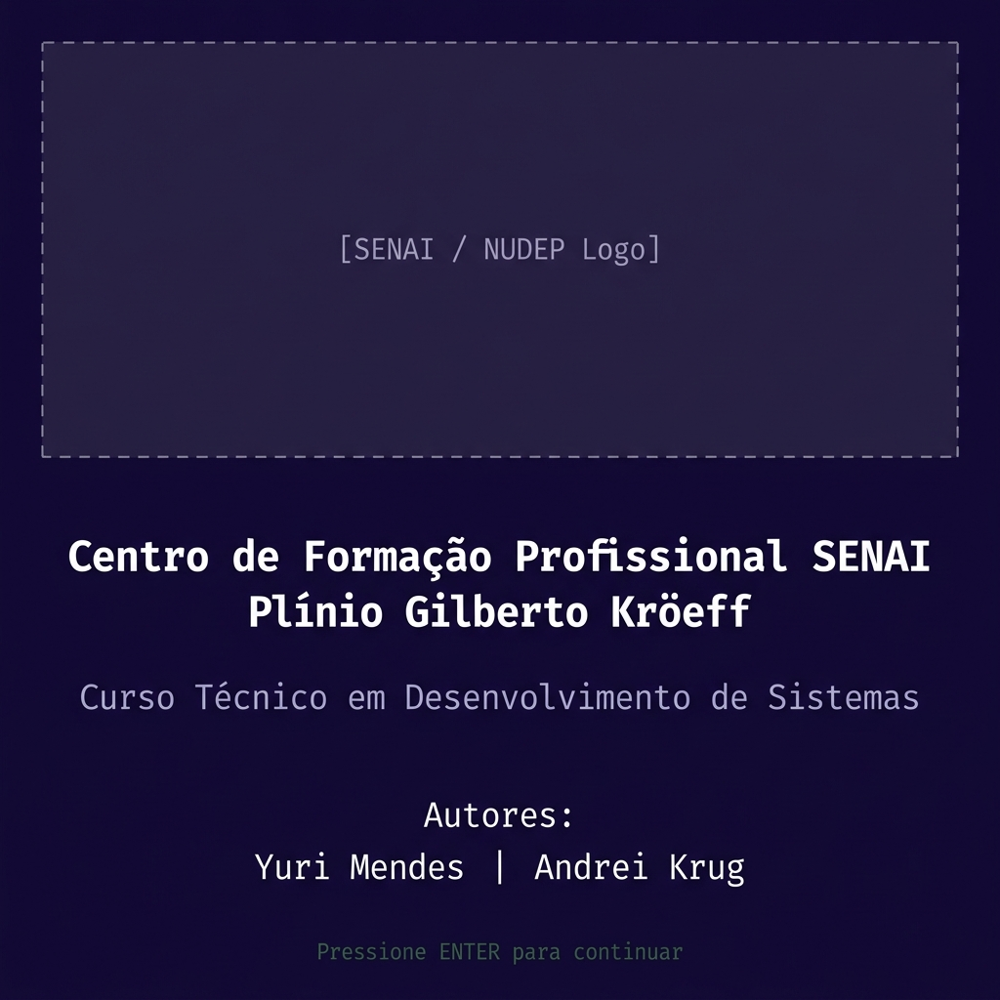
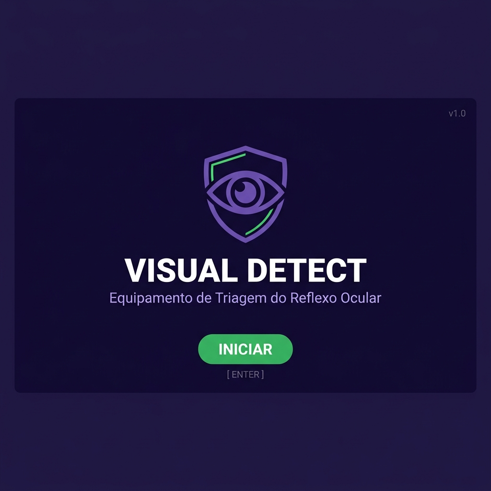
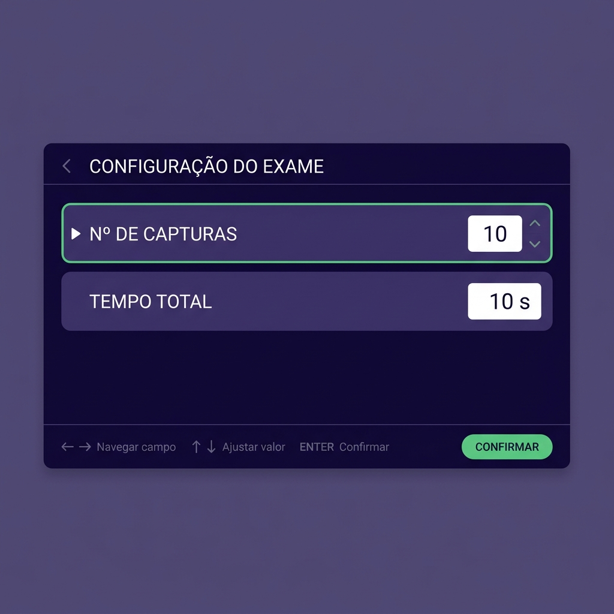
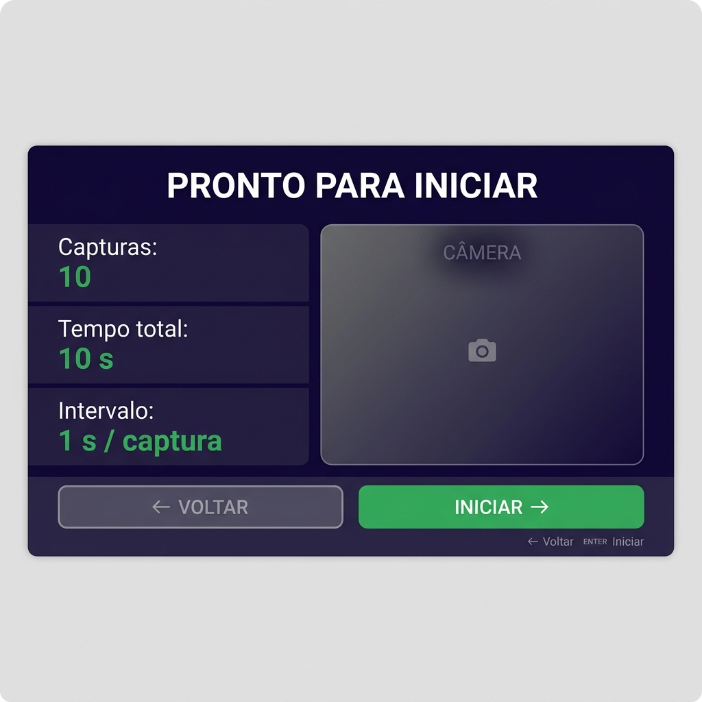
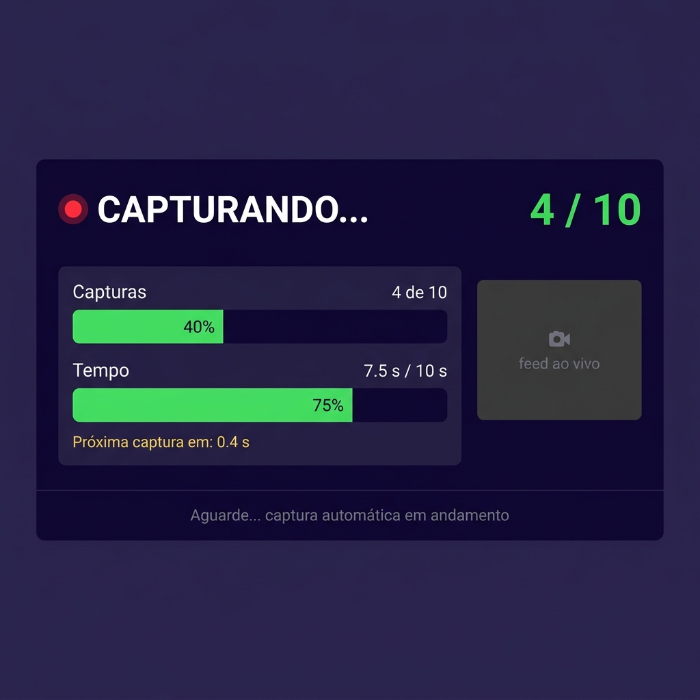
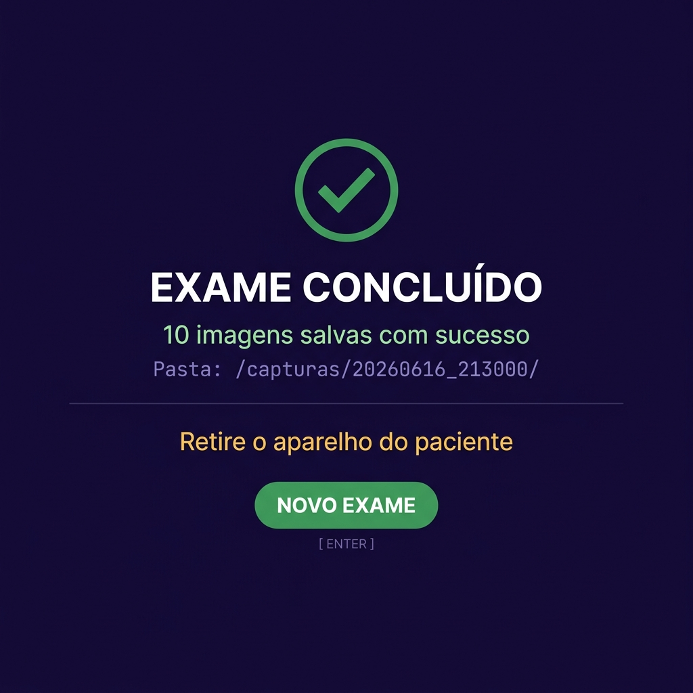

# Interface VisualDetect — Mockups de Tela

Rascunho visual do fluxo de telas da interface do equipamento.  
Paleta: roxo escuro `#1a0a3d` · verde `#00e676` · branco · âmbar para avisos.  
Display alvo: DSI (ribbon) do Raspberry Pi 4 — ~800×480px, sem toque, navegação via ESP32 HID.

---

## Fluxo de telas

```
[T0] Info SENAI  →  [T1] Splash  →  [T2] Config  →  [T3] Revisão + Feed
                                          ↑                    │
                                          └──── ← Voltar ──────┘
                                                               │ ENTER
                                                               ▼
                                                       [T4] Capturando
                                                       (automático)
                                                               │
                                                               ▼
                                                       [T5] Concluído  →  [T1]
```

---

## T0 — Informações Institucionais



- Logo SENAI / NUDEP (a inserir no código)
- Centro de Formação Profissional SENAI – Plínio Gilberto Kröeff
- Curso Técnico em Desenvolvimento de Sistemas
- Autores: Yuri Mendes | Andrei Krug
- `ENTER` → avança para T1

---

## T1 — Splash / VisualDetect



- Logo (olho + escudo) · "VISUAL DETECT"
- "Equipamento de Triagem do Reflexo Ocular"
- `ENTER` → vai para T2

---

## T2 — Configuração



- Nº de capturas e Tempo total configuráveis
- Campo ativo destacado em verde com indicador ►
- `← →` alterna campo · `↑ ↓` ajusta valor · `ENTER` → vai para T3

---

## T3 — Revisão + Feed da câmera



- Resumo: capturas, tempo total, intervalo calculado
- Feed ao vivo da câmera — operador posiciona o aparelho aqui antes de iniciar
- `←` volta para T2 · `ENTER` inicia exame → vai para T4

---

## T4 — Capturando (exame em andamento)



- Indicador ● CAPTURANDO... + contador X / N
- Barra de progresso: capturas e tempo
- "Próxima captura em: Xs"
- Feed da câmera pequeno, secundário
- **Todos os botões bloqueados** — captura 100% automática
- Transição automática para T5 ao finalizar

---

## T5 — Exame Concluído



- ✓ Exame concluído
- Nº de imagens salvas + caminho da pasta
- Instrução: "Retire o aparelho do paciente"
- `ENTER` → novo exame (volta para T1)

---

## Mapeamento de botões por tela

| Tela | ← | → | ↑ | ↓ | ENTER |
|---|---|---|---|---|---|
| T0 Info SENAI | — | — | — | — | Ir para T1 |
| T1 Splash | — | — | — | — | Ir para T2 |
| T2 Config | Campo anterior | Campo seguinte | Aumenta valor | Diminui valor | Ir para T3 |
| T3 Revisão | Volta para T2 | — | — | — | Inicia exame |
| T4 Capturando | 🔒 | 🔒 | 🔒 | 🔒 | 🔒 |
| T5 Concluído | — | — | — | — | Novo exame (T1) |
